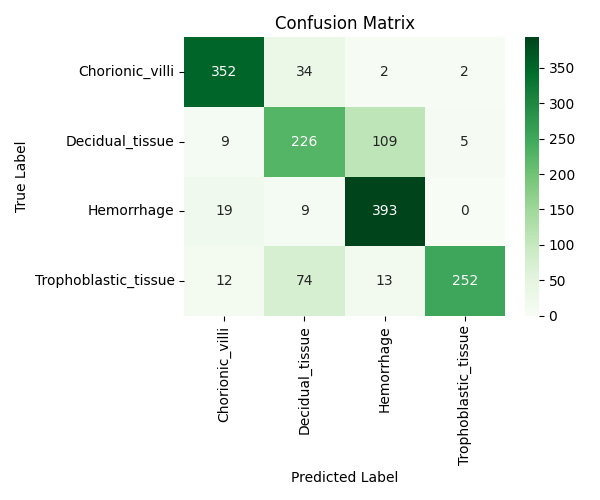

# Final Term Project — POC Tissue Classification with ResNet-18


Custom ResNet-18 implementation for 4-class POC tissue classification.


- Built with PyTorch
- Best validation accuracy: `92.78%`
- Final test accuracy: `87.62%`

---

## 1. Project Overview

This project was conducted as a final term project on CNN-based image classification. The goal was to classify microscopic images from the POC dataset into four tissue categories using a custom ResNet-18 model.

The overall pipeline includes dataset loading, train/validation split, data augmentation, model training, validation, early stopping, best model saving, and final test evaluation. The final model was assessed using overall accuracy, class-wise metrics, and a confusion matrix.

---

## 2. Training Pipeline

- Dataset loading and preprocessing
- Train/validation split
- Data augmentation applied to training set
- Model training with validation monitoring
- Early stopping and best model saving
- Final evaluation on the test set

---

## 3. Dataset

The dataset is organized under `POC_Dataset` with separate `Training` and `Testing` directories. Each directory contains class-specific folders.

### Classes

The classification task consists of the following four classes:

- `Chorionic_villi`
- `Decidual_tissue`
- `Hemorrhage`
- `Trophoblastic_tissue`

The label mapping used in the code is:

- `0`: `Chorionic_villi`
- `1`: `Decidual_tissue`
- `2`: `Hemorrhage`
- `3`: `Trophoblastic_tissue`

### Data Split

The dataset loader is implemented in `dataset.py`.

- Only `.jpg` images are loaded.
- The original `Training` set is split into training and validation subsets.
- The split ratio is `80%` for training and `20%` for validation.
- A fixed random seed (`42`) is used for reproducibility.
- The `Testing` set is strictly used only for the final evaluation.
  → This prevents data leakage and ensures a fair assessment of generalization performance.

---

## 4. Preprocessing and Data Augmentation

All images are resized to `224 x 224` to match the input size expected by the ResNet-18 architecture.

### Training Transform

The following augmentations are applied during training:

- `Resize((224, 224))`
- `RandomHorizontalFlip()`
- `RandomVerticalFlip()`
- `RandomRotation(10)`
- `RandomAffine(degrees=15, translate=(0.1, 0.1))`
- `RandomResizedCrop(224, scale=(0.8, 1.0))`
- `ColorJitter(brightness=0.3, contrast=0.3, saturation=0.2)`
- `ToTensor()`
- `Normalize(mean=[0.485, 0.456, 0.406], std=[0.229, 0.224, 0.225])`

These augmentations are applied to improve generalization and robustness, using techniques such as flipping, rotation, and color jittering.

### Validation and Test Transform

The following preprocessing is applied during validation and testing:

- `Resize((224, 224))`
- `ToTensor()`
- `Normalize(mean=[0.485, 0.456, 0.406], std=[0.229, 0.224, 0.225])`

No data augmentation is applied to validation and test sets to ensure a fair and consistent evaluation of model performance.

---

## 5. Model Architecture

The model is implemented in `model.py` as a custom **ResNet-18**.

Instead of using a pretrained implementation from `torchvision`, the network was manually built from scratch based on the original ResNet paper, which introduced residual learning with shortcut connections for deep neural networks.

### Residual Block

Each basic residual block includes:

- `3x3` convolution
- batch normalization
- ReLU activation
- `3x3` convolution
- batch normalization
- shortcut connection
- element-wise addition
- final ReLU activation

When the input and output dimensions differ, a `1x1` convolution and batch normalization are applied in the shortcut path.

### Network Structure

The overall model consists of:

- Initial `7x7` convolution with stride 2
- Batch normalization
- ReLU
- Max pooling
- `conv2_x` with 2 residual blocks
- `conv3_x` with 2 residual blocks
- `conv4_x` with 2 residual blocks
- `conv5_x` with 2 residual blocks
- Adaptive average pooling
- Fully connected layer for 4-class classification

---

## 6. Training Setup

The training procedure is implemented in `train.py`.

### Hyperparameters

- Model: custom `ResNet-18`
- Number of classes: `4`
- Batch size: `16`
- Number of epochs: `30`
- Learning rate: `1e-4`
- Weight decay: `1e-4`
- Loss function: `CrossEntropyLoss`
- Optimizer: `AdamW`

---

## 7. Training Stabilization Strategies

Several techniques were used to improve optimization stability and generalization:

- **Batch Normalization**  
  Applied throughout the network to stabilize training.

- **Data Augmentation**  
  Used to reduce overfitting and improve robustness.

- **Input Normalization**  
  Applied consistently to training, validation, and test data.

- **Weight Decay**  
  Set to `1e-4` in the optimizer for regularization.

- **Early Stopping**  
  Training stops when validation accuracy does not improve for 5 consecutive epochs.

- **Best Model Saving**  
  The model is saved whenever validation accuracy improves.

The best model weights are stored at: `./result/best_resnet18_poc.pth`

---

## 8. Results

Training and evaluation logs are stored in `result/result_log.txt`.

### Best Validation Performance

- **Best Validation Accuracy:** `92.78%`
- **Best Epoch:** `19`

### Final Test Performance

The final test evaluation was performed using the best saved model.

- **Test Accuracy:** `87.62%`

### Class-wise Performance

| Class | Precision | Recall | F1-score | Support |
|------|----------:|-------:|---------:|--------:|
| Chorionic_villi | 0.94 | 0.96 | 0.95 | 390 |
| Decidual_tissue | 0.91 | 0.61 | 0.73 | 349 |
| Hemorrhage | 0.78 | 0.97 | 0.86 | 421 |
| Trophoblastic_tissue | 0.92 | 0.94 | 0.93 | 351 |

### Confusion Matrix



---

## 9. Result Analysis

The model achieved strong overall performance on the 4-class classification task, reaching `92.78%` validation accuracy and `87.62%` test accuracy.

Among the four classes, `Chorionic_villi` and `Trophoblastic_tissue` showed the most balanced performance, with both high precision and high recall. `Hemorrhage` achieved very high recall, indicating that most true hemorrhage samples were correctly detected, although its lower precision suggests that some non-hemorrhage samples were predicted as hemorrhage.

`Decidual_tissue` was the most challenging class in this experiment. While its precision remained high, its recall was significantly lower than that of the other classes, indicating that many true decidual tissue samples were misclassified into other categories.

---

## 10. Output Files

The `result` directory contains the main outputs from training and testing:

- `best_resnet18_poc.pth`: best model weights based on validation accuracy
- `loss_curve.png`: training and validation loss curve
- `accuracy_curve.png`: training and validation accuracy curve
- `confusion_matrix.png`: confusion matrix on the test set
- `result_log.txt`: training logs and test evaluation results

---

## 11. Project Structure

```text
TP2_CNN_Classification/
│-- dataset.py
│-- model.py
│-- train.py
│-- test.py
│-- utils.py
│-- result/
│   │-- best_resnet18_poc.pth
│   │-- loss_curve.png
│   │-- accuracy_curve.png
│   │-- confusion_matrix.png
│   │-- result_log.txt
```

### File Description

- `dataset.py`: loads the dataset, maps class labels, and splits the training data into train/validation subsets
- `model.py`: implements the residual block and the custom ResNet-18 architecture
- `train.py`: handles training, validation, early stopping, logging, and curve visualization
- `test.py`: loads the best saved model and evaluates it on the test set
- `utils.py`: provides utility functions for device selection, evaluation, logging, and confusion matrix visualization

## 12. How to Run

### Train

```bash
python train.py
```

### Test

```bash
python test.py
```

Before running the code, the dataset should be placed under ./POC_Dataset with the following structure:

```text
POC_Dataset/
│-- Training/
│   │-- Chorionic_villi/
│   │-- Decidual_tissue/
│   │-- Hemorrhage/
│   │-- Trophoblastic_tissue/
│-- Testing/
│   │-- Chorionic_villi/
│   │-- Decidual_tissue/
│   │-- Hemorrhage/
│   │-- Trophoblastic_tissue/
```

## 13. References

- [Deep Residual Learning for Image Recognition (arXiv)](https://arxiv.org/abs/1512.03385)  
- [Deep Residual Learning for Image Recognition (CVPR 2016)](https://openaccess.thecvf.com/content_cvpr_2016/papers/He_Deep_Residual_Learning_CVPR_2016_paper.pdf)

---

## 14. Conclusion

This project implemented a custom ResNet-18 model for 4-class classification on the POC dataset. The training pipeline included augmentation, normalization, AdamW optimization, weight decay, and early stopping. The model achieved `92.78%` validation accuracy and `87.62%` final test accuracy.

The results show that the model performed well overall, while also revealing that some classes were more difficult to classify than others. In particular, `Decidual_tissue` remained the most challenging class based on recall. This project demonstrates that a custom ResNet-based CNN can effectively perform POC tissue classification with strong overall accuracy.
